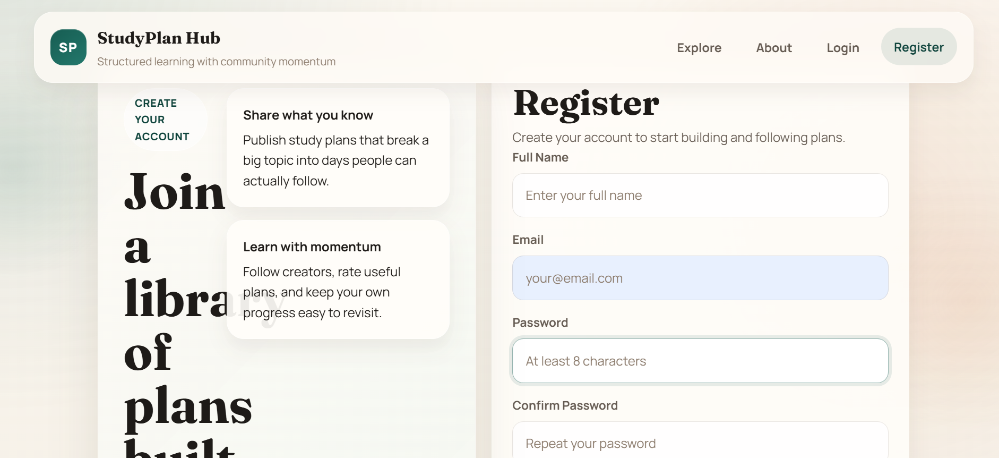
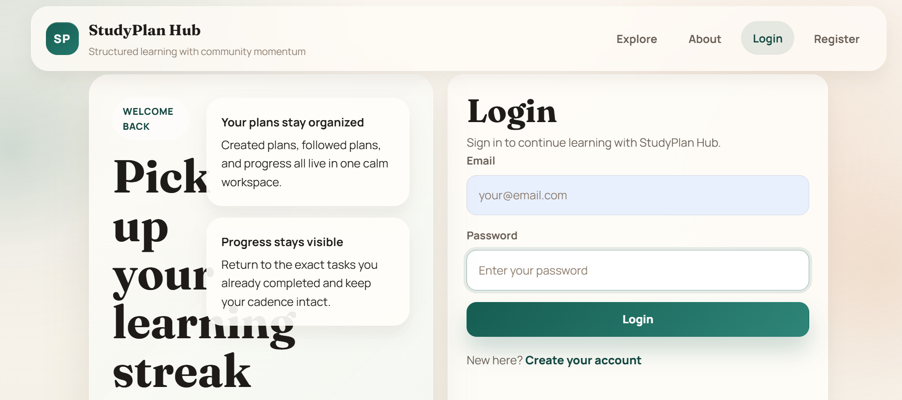

# StudyPlan Hub

StudyPlan Hub is a web-based application designed to help students manage their study schedules and daily tasks in an efficient way. It allows users to create, organize, and track their study plans, helping improve productivity and consistency through a simple and user-friendly interface.

---

## Features

* Create and manage daily study plans
* Track task completion and progress
* Improve productivity with structured scheduling
* User authentication system (if implemented)
* Responsive design for different devices

---

## Tech Stack

Frontend:

* HTML
* CSS
* JavaScript

Backend :

* Node.js
* Express.js

Database :

* MongoDB / MySQL

---

## Project Structure

StudyPlanHub/
│── frontend/
│── backend/
│── README.md
│── package.json

---

## Installation and Setup

1. Clone the repository:

```bash
git clone https://github.com/Aryan0l/StudyPlanHub.git
```

2. Navigate to project folder:

```bash
cd StudyPlanHub
```

3. Install dependencies:

```bash
npm install
```

4. Start the server:

```bash
npm start
```

5. Open in browser:

```bash
http://localhost:3000
```

---

## Screenshots

### Register Page


### Login Page


### Explore Page


### About Page


## Live Demo

Add your deployed project link here

---

## Future Improvements

* Add reminders and notifications
* Add dark mode
* Add mobile app version
* Add AI-based study recommendations

---

## Contributing

Contributions are welcome. You can fork this repository and submit a pull request.

---

## License

This project is licensed under the MIT License.

---

## Author

Aryan Raj
GitHub: https://github.com/Aryan0l

---

If you find this project useful, you can give it a star on GitHub.
